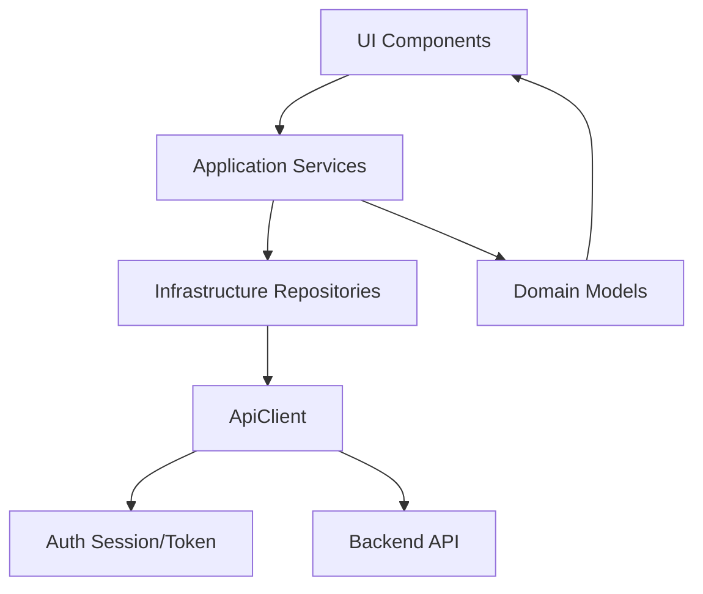

# Architecture Overview

## System Context
The frontend is a React + TypeScript single-page application for eBL scholarly workflows, integrating fragment management, corpus navigation, dictionary lookup, sign data, bibliography, chronology, and project-level research views.

## Primary Entry Points
- [src/index.tsx](src/index.tsx): application bootstrap and provider setup.
- [src/App.tsx](src/App.tsx): shell composition, boundary wiring, router mounting.
- [src/router/router.tsx](src/router/router.tsx): global route orchestration.

## Architectural Layers
1. UI Components
  - Feature views and controls under src/<feature>/ui.
2. Application Services
  - Orchestration logic under src/<feature>/application.
3. Domain Models
  - Entities and invariants under src/<feature>/domain.
4. Infrastructure Adapters
  - API repositories and DTO mappers under src/<feature>/infrastructure.
5. Transport/Auth
  - ApiClient and auth/session in [src/http/ApiClient.ts](src/http/ApiClient.ts) and [src/auth](src/auth).

## Dependency Diagram

## Cross-Cutting Concerns
- Authentication/session: [src/auth](src/auth)
- Error boundaries and UI-level recovery: [src/common/ErrorBoundary.tsx](src/common/ErrorBoundary.tsx)
- Transport failures and normalization: [src/http/ApiClient.ts](src/http/ApiClient.ts)
- Routing/deep-linking: [src/router](src/router)
- Test harness and fixtures: [src/test-support](src/test-support)

## Traceability Links
- Full source file inventory: [docs/reference/code-index.md](docs/reference/code-index.md)
- Module behavior catalog: [docs/reference/module-behavior-catalog.md](docs/reference/module-behavior-catalog.md)
- Exported symbol index: [docs/reference/symbol-catalog.md](docs/reference/symbol-catalog.md)
- Endpoint contracts: [docs/reference/api-endpoints.md](docs/reference/api-endpoints.md)
