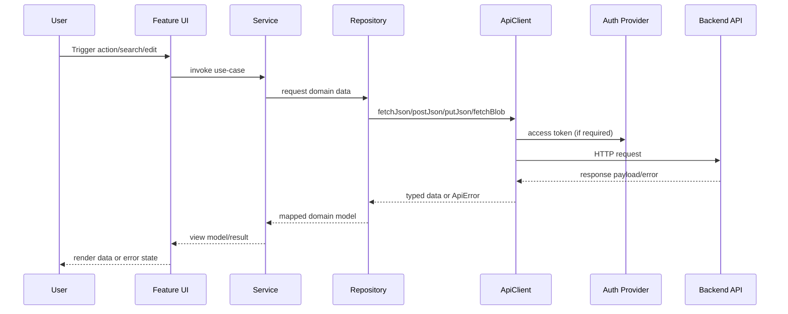
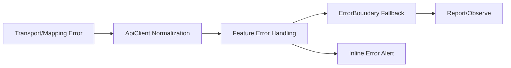

# Runtime and Data Flow

## App Boot Sequence
1. Browser loads bundle and calls [src/index.tsx](src/index.tsx).
2. Auth, session, routing, and service providers are initialized.
3. [src/App.tsx](src/App.tsx) mounts global shell and route graph.
4. Feature routes render UI pages and invoke services.

## Request Lifecycle Sequence

## Error and Recovery Flow

## Failure-Mode Notes
- Token acquisition failures: authenticated routes/actions can fail even if route shell loads.
- Backend shape mismatch: repository/domain mapping can throw during transformation.
- Partial data rendering: components should tolerate optional fields without hard crash.

## Traceability
- ApiClient behavior: [src/http/ApiClient.ts](src/http/ApiClient.ts)
- ApiClient tests: [src/http/ApiClient.test.ts](src/http/ApiClient.test.ts)
- Security tests: [src/__tests__/security-api.test.tsx](src/__tests__/security-api.test.tsx)
- Router composition: [src/router/router.tsx](src/router/router.tsx)
