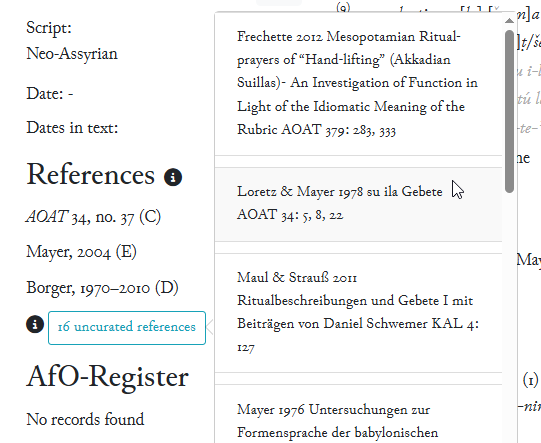
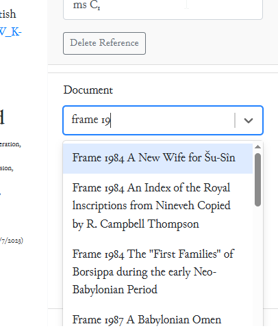
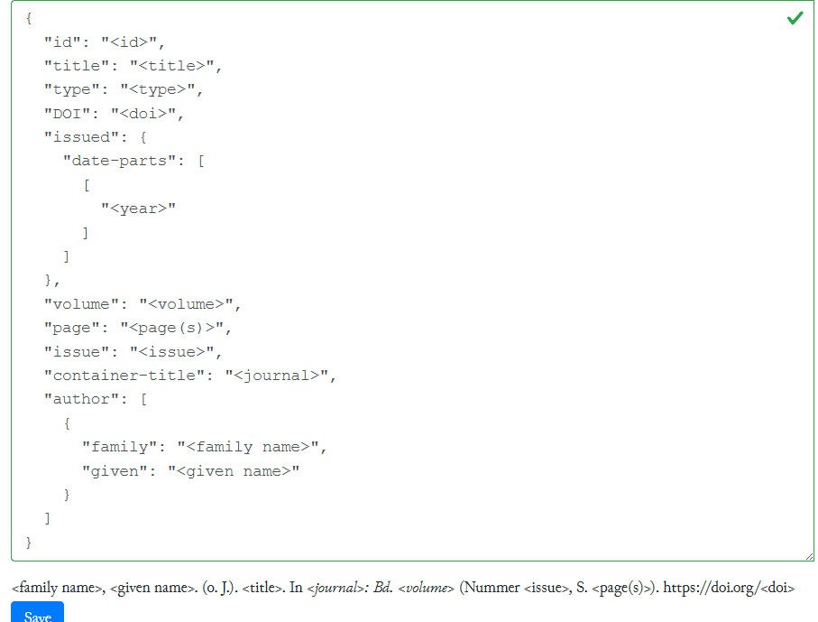

# Adding References to eBL
1. Most of the items in Fragmentarium have “uncurated references” that can be found by clicking the button on the left side of the page under the heading “References”. The uncurated references have been generated by conducting an automatic search in a collection of PDF-files, and the hits with the tablet number are shown here. Note: the page numbers given in the uncurated references are the page numbers of the PDF-file, not the actual publication!
2. 

3. In order to turn uncurated references into proper references, you need to check if the reference is correct or not, and then enter the information in the reference tab. Some of the uncurated references are incorrect (e.g. because of OCR mistake of the number 8 for 0, or because of an error in the publication). Because the PDF-collection can have duplicate files of the same publication, there may be more than one uncurated references that result in a single proper reference.

4.	In the **Reference Tab**, a reference can be entered by (a) Clicking on **Add Reference** at the bottom, typing the name of the author in the “Name Year Title” field and then choosing the publication in question from the list.

4. Indicate the type of publication in the drop-down list (`Edition`/`Discussion`/`Copy`/`Photo`/`Translation`/`Archaeology`).
   
6. If a publication cites particular lines, they should be indicated in the field `Lines Cited`.

7. The bibliography database is growing and does not necessarily contain the information of the relevant publication. **Before creating a new entry, please make sure that it does not already exist.** In this case, a new entry needs to be generated in the Bibliography section of the website (link at the top of the page). Go to `Bibliography` → `References Tab` → `+ Create`

8. There are multiple ways of entering new references. If the reference has a DOI, you can simply select the entire field, replace it by the DOI, and press Save.

9. You can also import a reference in RIS style, CSL-JSON, BibTeX, or any other [supported input format](https://citation.js.org/api/0.3/tutorial-input_formats.html).
   
10. If no input format is avialable, the simplest way to create a new record is to find a similar publication by the same author in the bibliography and then to copy the information that can be accessed by clicking the edit icon on the left side of the entry. The copied information should then be pasted into a new bibliography entry that you can create by clicking the `+ Create` button on the right side of the page in the bibliography section. Then adjust the information (change the title, year, page numbers etc.), and **remember to remove the `id` of the original entry.**
