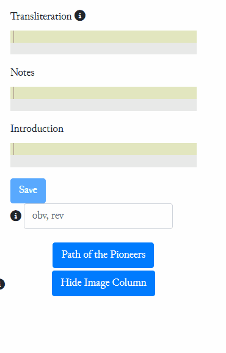

# Instructions for the use of the Library

**General Transliteration Rules for the eBL**

The eBL project uses a version of the A(scii)T(ransliteration)F(ormat). The ATF, used both by CDLI (in its ASCII version) and by Oracc (in its Unicode version), is the most popular format for the transliteration of cuneiform texts. A complete guide to Oracc ATF can be found [here](http://oracc.org/doc/help/editinginatf/). The eBL-specific conventions are documented [here](https://github.com/ElectronicBabylonianLiterature/ebl-api/blob/master/docs/ebl-atf.md).

1. New lines can be genereated by entering in the field to the right of `Save` the number of lines (you can also use prime after the number of lines if the lines have a prime mark, and use e.g. `3′, 5` for obv and rev). Then press Enter.

<p align="center">
 
</p>

2.  Avoid using accents. Use instead Unicode subindex numbers (Alt + Number). Do not use a breve under H or h: use H or h, not Ḫ or ḫ.

3.  For indented lines, use `($___$)` (i.e., three underscores between dollar signs and parentheses) to Mark a blank space. Use in particular at the beginning of the line, avoid using it in the middle of the line.

4.  If fragments have been identified and an absolute numeration can be established on the basis of duplicates or joins, then give the absolute numerations in notes, but retain the relative numeration in the edition. Thus:
 
 ```
4'. [... ku]l-ba-ni-iš
\#note: 20
5'. [...] UZU-MEŠ-šu
\#note: 21
```

5.  Capitals should be used only when it is clear that a certain sign is a logogram. Otherwise, it may confuse the lemmatizer. For signs of uncertain reading, use non-caps.

6.  Avoid using slash for different readings of the same sign. `ku/lu` → OK, but **ku/tuš** → NO

7.  Columns: `@column 1`, `@column 2`, etc.

8.  Rulings: `$ single ruling`, \$ double ruling, etc.

5.  `IGI-MIN`, `GEŠTU-MIN`, etc.

6.  `$ traces`

7.  If a line is the last of a tablet (in Lambert’s papers, “edge”), then add a line saying “`$ end of side`”, “`$ end of column`”, “`$ end of obverse`”, etc. E.g. [K.18264](https://www.ebl.lmu.de/library/K.18264)

8.  If a line is the first of a tablet, **do not use prime numbers**

9.  Use short readings of mimated signs: tu₄ instead of tum, ti₃ instead of tim, lu₄ instead of lum, etc.

10. Document-oriented glosses (“scribal comments on the document including 10-marks, line-count summaries and asides such as he-pi₂”) should be enclosed in {(…)}, e.g. {(he-pi₂)}.

11. **Use `@colophon` to mark the section containing the colophon (after the ruling).** [Addition, 01.2020]

12. **Colophons should be added to the Colophon database ([here](https://gwi-fm1.gwi.uni-muenchen.de/fmi/webd/AsbCol), user name and password provided separately).** [Addition, 05.2020]

13. **Tablets with interesting epigraphic features should be added to this list ([here](https://trello.com/c/fmxeDDGE)), so that they can be systematically tagged.** [Addition 09.2020]

14. In the case of intralinear bilinguals sumerian and akkadian should each be transliterated in a separate line. To differentiate add `a` and `b` to the line number, so. e.g. 
`4a. %sum [transliteration of the sumerian version]`  
`4b. ($___$) [transliteration of the akkadian version]`

15. If textcritical glosses don't repeat the antecedent in full the respective word needs to be supplied, e.g. `er₂-ra : <(er₂)>-ta`.

## **Joins**
1.  Joining pieces should be edited in a single edition on the page of the fragment with the lowest museum number.

## **Lemmatization**
 1.     Whenever possible, the lemmatization feature should be used (lemmatization tab). The lemmatization follows the `Concise Dictionary of Akkadian`.
 2.     The program automatically recognizes some of the lemmas, and these are shown red in the lemmatization tab. In the case of these lemmas, you just need to check if the proposed lemma is correct. After revising them, press `Save` to consolidate them.
 3.     The lemmas without colour need to be entered manually. Click on the lemma, and either choose from the proposed lemmas or type in the lemma (no special characters needed) in order to find it. If needed, consult the dictionary feature (= CDA) to differentiate between ambiguous lemmas.
 4.     The lemmatization dialogue is insensitive to special characters: `s` = `s`, `ṣ`, `š`; `a` = `a`, `ā`, `â`.
 5.     Statives should be lemmatized under the infinitive (`par-sat` → `parāsu I`)
 6.     Most participles have independent entries (so `pa-ri-su` → `pārisu`). If they don’t, lemmatize them under the infinitive (`ta-bi-ku` → `tabāku`, since there is no `tābiku`).

## **Genres**
 1.     Genres are divided into four major groups: **Archival**, **Canonical**, **Monumental**, and **Other**. In the groups there are up to three levels of categorisation, e.g. CANONICAL > Literature > Monologue and Dialogue > Fables.
 2.     To add a genre classification to a tablet simply select the appropriate option from the drop-down menu under "Genres".
 3.     It is possible to add several genre classifications to one tablet.
 4.     If only the genre group that a text belongs to is known, just select one of the four groups from the drop-down menu.

## **Conventions for RECC and CAIC Projects**

### References
Most of the items in Library have “uncurated references” that can be found by clicking the button on the left side of the page under the heading “References”. The uncurated references have been generated by conducting an automatic search in a collection of PDF-files, and the hits with the tablet number are shown here. Note: the page numbers given in the uncurated references are the page numbers of the PDF-file, not the actual publication!
1. In order to turn uncurated references into proper references, you need to check if the reference is correct or not, and then enter the information in the reference tab. Some of the uncurated references are incorrect (e.g. because of OCR mistake of the number 8 for 0, or because of an error in the publication). Because the PDF-collection can have duplicate files of the same publication, there may be more than one uncurated references that result in a single proper reference.
2. In the reference tab, a reference can be entered by typing the name of the author in the “Name Year Title” field and then choosing the publication in question from the list (In the case of references in CAD, choose “Oppenheim 1956–2011” and enter the letter of the volume in the pages field (e.g. B, 89))
3. Indicate the type of publication in the drop-down list (Edition/Discussion/Copy/Photo/Translation/Archaeology).
4. If a publication cites particular lines, they should be indicated in the field “Lines Cited”.
5. The bibliography database is growing and does not necessarily contain the information of the relevant publication. In this case, a new entry needs to be generated in the Bibliography section. See [Adding References to eBL](https://github.com/ElectronicBabylonianLiterature/generic-documentation/blob/master/guides/addingReferences.md)

### Transliteration

1. In Sumerian, use the readings from [Mittermayer’s sign list](https://doi.org/10.5167/uzh-156871) and [Attinger’s dictionary](https://www.academia.edu/106857838/Glossaire_sum%C3%A9rien_fran%C3%A7ais_principalement_des_textes_litt%C3%A9raires_pal%C3%A9obabyloniens_Deuxi%C3%A8me_%C3%A9dition_revue_et_augment%C3%A9e).
2.	Joining pieces should be edited in a single edition on the page of the fragment with the lowest museum number. For pieces joining indirectly, use section line numbers (e.g. a+1) where necessary.
3.	For restorations of words completely broken off, transcription (introduced by `%n`) can be used, e.g.: `1. e-nu-m[a %n eliš lā nabû šamāmū]`

### Lemmatization
1. All Akkadian texts should be lemmatized. **Sumerian** lemmatization will be implemented later in the course of the project. The lemmatization of **Personal Names** is possible for some Akkadian names, but a completely lemmatization of personal names will only be implemented later in the course of the project.
2. The program automatically recognizes some of the lemmas, and these are shown red in the lemmatization tab. In the case of these lemmas, you just need to check if the proposed lemma is correct.
3. Do not lemmatize `KIMIN`, `MIN`, etc.
4. The lemmas without color need to be entered manually. Click on the lemma, and either choose from the proposed lemmas or type in the lemma (no special characters needed) in order to find it. If needed, consult the dictionary feature (= CDA) to differentiate between ambiguous lemmas.
5.	Most participles have independent entries (so `pa-ri-su` → `pārisu`). If they don’t, lemmatize them under the infinitive (`ta-bi-ku` → `tabāku`, since there is no `tābiku`).

### Translation
1. Translate every line, also those in which no sign can be read (`#tr.en: […] … […]`)
2.	In the translation, use `…` (U+2026 Horizontal Ellipsis) instead of three periods (`...`)
3.	Use curly quotes (`“”` instead of `""`)
4.	Mark in italics uncertain translations (@`i{uncertain}`)
5.	Do not italicize brackets (`[@i{uncertain}]`).
6.	Avoid splitting words in the translation in brackets:
`1. LU[GAL ina KUR]`
`#tr: the king [in the land]`

### Commentary
1. Be sure to incorporate all relevant literature into the edition, and cite it in inline comments (`#note: Comment here`) if necessary.
2. When citing sources, use the code `@bib{REFERENCE_ID@PAGES}` and explicitly state what they say. Not just “On this line, see @bib{RN117@125}” but “On this line, see @bib{RN117@125}, who states that it should be corrected to abc.”

### Introduction
The introduction (max. 100 words) should contain the following elements:
1.	Description of content and structure
2.	Material aspects (Layout, diplomatics, state of preservation, etc.)
3.	Context (Archaeology, Sitz im Leben, etc.)
(If the References are not enough, it can also include a History of Research with selected Bibliography)

Example ([ND.6200](https://www.ebl.lmu.de/library/ND.6200)):
```
This tablet contains portions of what appears to be a hymn to Nippur, its sanctuaries and gods. The first column seems to describe the Nippur people in general (i′ 2′, @i{ṣābū kidinni}), whereas the second contains a list of shrines attached to the Ekur temple together with their epithets.
	The tablet has two columns per side; the presence of a decimal marker in ii′ 12′ means that the text was probably very long. The lower section of the second column is a duplicate of @url{BM.82959}. The tablet ND.5592 belongs in all likelihood to the same manuscript. 
	The manuscript was found in the Ezida temple of Nabû in Kalḫu, although its exact provenance is unknown.
 ```

Use eBL markup: `@i{}`, `@bib{}`, etc. (see (here)[https://github.com/ElectronicBabylonianLiterature/ebl-api/blob/master/docs/ebl-atf.md#ebl-atf-specification]).

### Correction
1. All editions should be checked twice by the editor against the copy or the photo: one on the day the edition is prepared, and again the day after.
2.	At the end of an edition, check also that the translation corresponds with the transliteration.
3.	Check that there are no typos in the translation, notes or introduction.
4.	In particular at the beginning of the project, not many tablets will be available as photos. When the photos become available, the editions should be collated and corrected. Mark signs in need of correction with `!?`, e.g. `ša₂!?`.

### Colophons
1. If a tablet contains a colophon, make sure to add the information to the tab Colophons.
2. `IM/DUB + PN` is the owneer, `ŠU + PN` the writer.
3. Use first-millennium case endings (i.e. -*u+ for nom. and acc. and -*i* for gen.) and all diacritics. E.g. `Bēl-zēru-līšir`.
