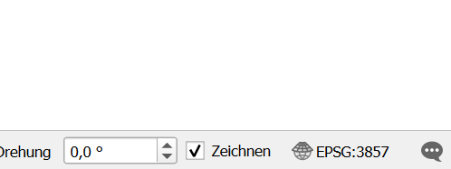
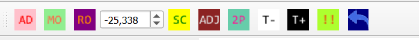
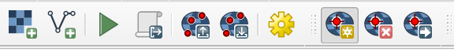
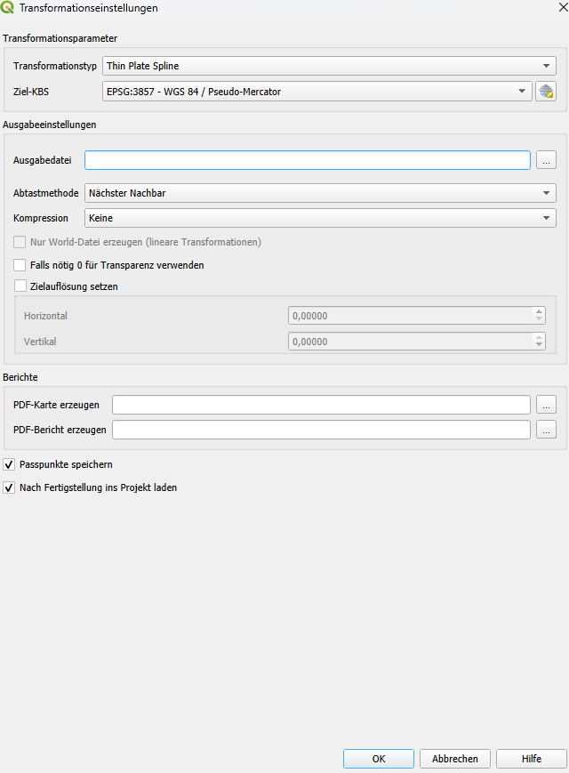
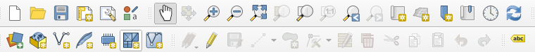
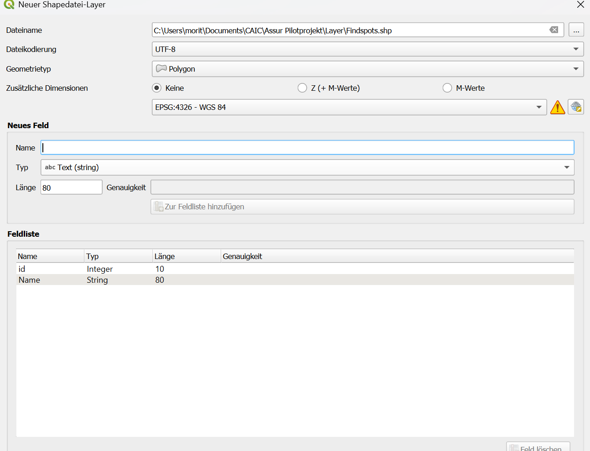
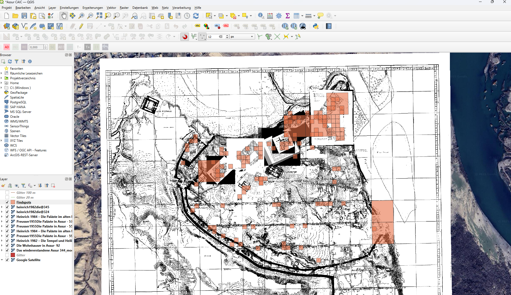

# **A manual for mapping cuneiform tablets in the context of the CAIC project**

Moritz Kellerer; 10.10.2025

### **Introduction**

The final product of this guide are

1\. Georeferenced plans of sites (GeoTiffs)

2\. A shape file that marks the findspots of the tablets

3\. A list in which each tablet is assigned a GeoTiff on which the findspot of this tablet is located

### **Preparation**

**1.**  This guide is based on the example site of Assur. The first step is to copy all records (i.e. all boards) to this location from the "Findspots" table of the CAIC project into an Excel file and add the "map" column. Next, it is recommended to create the following folder structure:

**2.** Next, the relevant literature on this site (i.e. the literature that contains information about the sites and corresponding map material) must be identified and procured. The PDFs should not have a resolution below 600 dpi, and are stored in the "Literatur" folder.

**3.** The literature is then searched. Each plan that can be found should be saved separately as an image in the "Karten" folder. In common PDF readers (e.g. PDF24), this can be done quickly by right-clicking → save page as image.

         

### **Georeferencing**

**4.** Next, a QGIS project is created in the "Assur QGIS" folder. For the previous work on this project, the QGIS version 3.36.3 "Maidenhead" was used. In the QGIS project, the project KBS is set to **EPSG 3857 – WGS 84 / Pseudo-Mercator**.

         

**5.** Under the "Erweiterungen" tab, two plug-ins must be installed when setting up QGIS for the first time. The first plug-in is "QuickMapServices", which allows you to quickly and easily load common satellite maps into the QGIS project. The second plug-in is the "Freehand raster Georeferencer", which can be a great help in georefencing the maps.

**6.** After installing the two plug-ins, it makes sense to load Google Satellite into the project via "QuickMapServices" for orientation. To do this, navigate via the "Web" tab → "QuickMapServices" → Google Satellite.

**7.** After finding the location on the satellite map, the next step is to georeference the maps. If the location shows enough visible clues to locate the maps without any doubt, this can be done directly via the "Layer" button → "Georeferencing" (see step 8). If not, the "Freehand raster Georeferencer" can be used to do the preparatory work. This plug-in allows you to move and customize the maps freely. To use the tool, you first have to right-click on the toolbar and click on "Freehand raster Georeferencer" in toolbars. This will bring up a new toolbar:

         

The AD button can now be used to insert maps. With the other functions they can be moved, rotated, scaled and distorted. This allows the correct position of the map to be determined before the actual georeferencing. For three reasons, the "Freehand raster Georeferencer" cannot be used directly for the final result:

1) The resolution of the inserted images suffers.
2) Distortions that occur in the plans during printing or scanning are difficult to remove.
3) There may be problems with the export.

**8.** Next comes the actual georeferencing of the plans. To do this, navigate via "Layers" → "Georeferenzierung". In the window that opens, click on the "Raster hinzufügen" button on the far left and choose the map you want to insert.

         

` `The map will appear in the window. Now the work begins to set control points. To do this, click on a feature of the map, which can be clearly identified either on the satellite image or on the map previously placed with the "Freehand raster Georeferencer". The following window appears:

The set coordinate system must be called **EPSG 3857 – WGS 84 / Pseudo-Mercator** as well as the project KBS. Now there are several possibilities: If the coordinates of the selected point are known from the publication, they can be entered directly. If not, you have to click on "aus Kartenansicht". Then you simply select the corresponding point on the map. This should now be done with as many points as possible. The better the map corresponds to the actual conditions, the fewer points are needed (minimum about 10), for larger maps (e.g. total maps of sites such as Uruk or Babylon), which may have distortions, a few hundred points should be placed if possible. When enough points have been set, the transformation settings must be set. To do this, click on the yellow gear in the upper control panel.

         

The transformation type depends on the number of points set. If possible, Thin Plate Spline should be chosen, then Polynomial 3-1, and worst case Helmert. More information about the transformation types and georeferencing in QGIS in general can be found here:

<https://docs.qgis.org/3.40/de/docs/user_manual/managing_data_source/georeferencer.html>

Then the output file name must be created. The easiest way is to click on the three dots on the right, go to the folder "Georeferenzierte Karten" at the corresponding location, and enter the desired file name there. With the green arrow in the upper bar you start the georeference.

It is advisable to start with an overview map of the site, then go directly to the "Map findspots" step, and finally refer only to the maps that are really relevant for the clay tablet finds.

### **Map Findspots**

**9.** After the most important maps have been georeferenced, the sites can now be mapped. To do this, you first have to create a new shape file by clicking on the third control element of the second row.

         

This window opens: To set the file name, click on the three dots to the left of the input field, navigate to the previously created folder "Layer" and then name the file Findspots. For Geometry Type, "Polygon" is entered. A new field must be added to the field list: To do this, enter "Name" in the field for the name and click Ok. Now the shape file can be created. Next, the locations from the list are marked on the map. In the "Name" field, the exact name of the location is always taken from the list. The ID field can theoretically be left blank; however, it can be useful to assign consecutive numbers to keep track.

         

### **Finalization**

**10.** When all relevant maps are georeferenced and all locations have been marked on the map, the created GeoTiffs still need to be named correctly. The scheme is `EBL-literature-ID@pageNumbers`. If no EBL ID exists yet, it must be created (see [Adding References to eBL](addingReferences.md)).

**11.** Now you have to enter in the list which location is shown on which map. For this purpose, the name of the corresponding GeoTiff files is specified in the "map" column.

**12.** Finally, the relevant files for submission are collected: These include the GeoTiffs, the list of locations, and the.cpg,.prj,.shp,.shx, and.dbf files of the Findspots layer.

         

