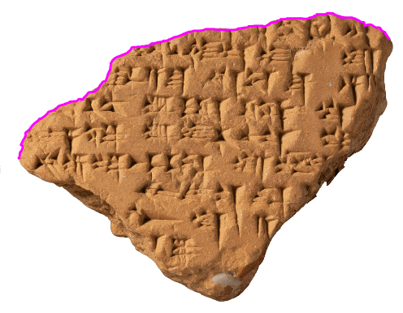
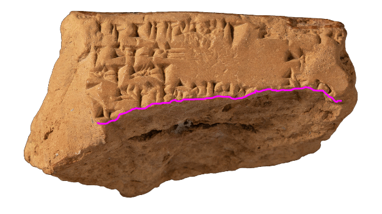
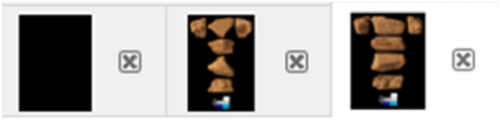
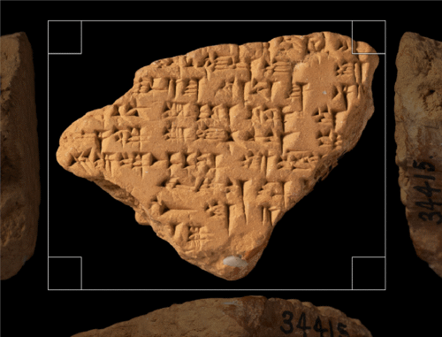
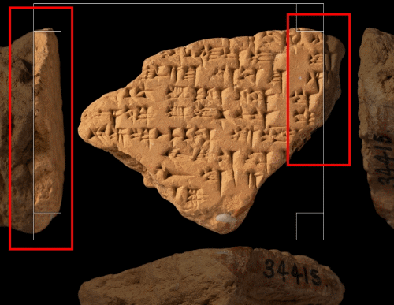
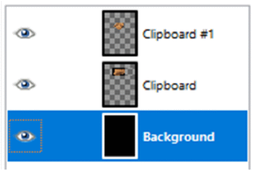

# How to Create Photo Montages of Tablets to Check Joins

## Summary
1) Choose Layer Order for Fragments
2) Create Empty Black Canvas onto Which to Fit Both Fragments
3) Load Images into GIMP
4) Crop Image of Background Fragment
5) Crop and Clip Image of Foreground Fragment
6) Copy Prepared Images and Paste Them onto Empty Canvas
7) Rearrange Fragments on Canvas
8) Add Description Label and Crop Photomontage
# Detailed Instructions
## 1) Choose Layer Order for Fragments
* For a convincing photomontage of a join, you need to choose a suitable layer order 
for the two joining fragments:
* The foreground fragment should be the one with the clearer break edge, so that only 
the inscribed surface and no sub-surface parts of the foreground fragment 
will cover the background fragment:

| foreground fragment | background fragment |
| :---: | :---: |
|  |  |

## 2) Create Empty Black Canvas onto Which to Fit Both Fragments
* Click on **[File]** > **[New...]**
* In the dialog, choose approximate height and width of canvas 
so that it is big enough for both fragments
* Click on **[+]** to the left of **Advanced Options**
* Set **Fill with:** to **Foreground colour** (which by default is black)
* Confirm by clicking on **[OK]**

## 3) Load Images into GIMP
For both images do the following:
* Copy image to clipboard
* In GIMP, insert image into new canvas: **[File]** > **[Create]** > **[From Clipboard]**

## 4) Crop Image of Background Fragment
* Select _Crop Tool_ by clicking on **[]** or by pressing **[Shift]** + **[C]**
* Drag a margin around the part of the image you want to use in the photomontage
* Confirm by hitting **[Enter]**

## 5) Crop and Clip Image of Foreground Fragment
* Switch to image of foreground fragment by clicking on the respective thumbnail image 
at the top margin of the window

* Again, select _Crop Tool_ and crop image to the desired section. This time, it is important that your cropped image only leaves one side of the foreground fragment and has it completely surrounded by an even (black) background

| correct cropping section | problematic cropping section |
| :---: | :---: |
|  |  |

* Select _Fuzzy Select Tool_ by clicking on **[]** or by pressing **[U]**
* Click anywhere in the even background. This will select everything but the fragment
* Now, invert this selection by pressing **[CTRL]** + **[I]**

## 6) Copy Prepared Images and Paste Them onto Empty Canvas
* Switch to background fragment and copy it to clipboard (**[CTRL]** + **[C]**)
* Switch to empty canvas and paste as new layer (**[Edit]** > **[Paste as]** > **[New Layer]**)
* Repeat with foreground fragment

## 7) Rearrange Fragments on Canvas
* Transform fragments to make them join neatly
* For this, select layer you would like to transform by clicking on the respective thumbnail image 
in the layer bar to the right of the window

* The main tools you will need to transform fragments are:
	* The _Move Tool_ (**[]** or **[M]**)
	* The _Rotate Tool_ (**[]** or **[Shift]** + **[R]**)
	* The _Scale Tool_ (**[]** or **[Shift]** + **[T]**) - hold **[Shift]** to maintain aspect ratio

## 8) Add Description Label and Crop Photomontage
* You can add a description label to indicate which fragments you have joined
* For this, select _Text Tool_ (**[]** or **[T]**)
* Click where you want to add your label to the canvas
* Type in the information you would like to give
* Change font size and colour by first selecting what you have typed (**[CTRL]** + **[A]**)
and then changing the necessary parameters in the menu above your text
* Remove any excess margins of the photomontage by cropping it with the _Crop Tool_
